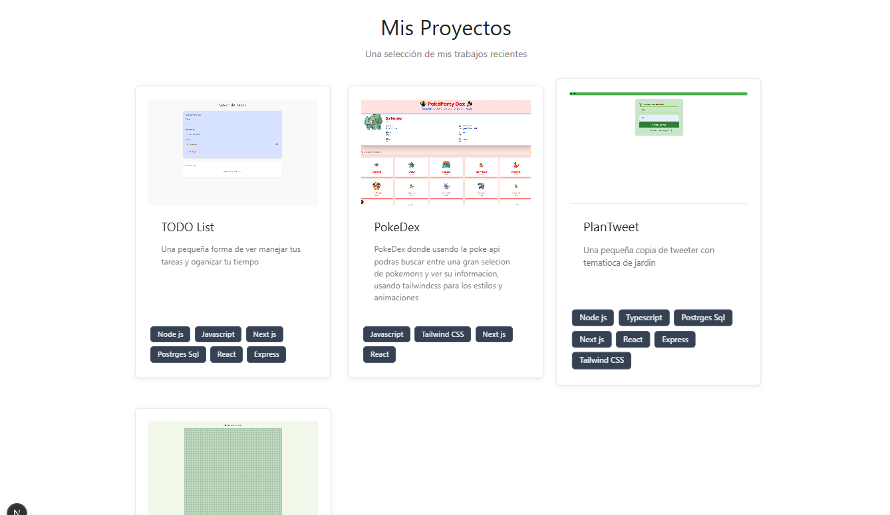

# 🌿 Github Poject Client

[](https://opensource.org/licenses/MIT)
[](https://nextjs.org/)
[](https://www.typescriptlang.org/)

Este projecto junta algunos projectos pequeños que muestran mis conocimientos en desarrollo web

 

##  Características principales

- **Diversidad de Projectos**: Encuentra repositorios con autocompletado
- **Log/in**: uso de Use Auth para autentificacion de usuarios

## Tecnologías utilizadas

| Tecnología       | Uso                          |
|------------------|------------------------------|
| Next.js 13       | Framework React SSR/SSG       |
| Tailwind CSS     | Estilizado con clases utilitarias |
| Javascript.js       | Creacion de algoritmos para PlantLaybirth |

##  Cómo empezar

### Requisitos previos
- Node.js 18+
- Cuenta de GitHub (opcional para autenticación)

### Instalación

1. Clona el repositorio:
```bash
git clone https://github.com/AguilarAlvarez/project-github-client.git